# <center>仰望心空——同济交友网站</center>

<center>开发&维护团队：2020计科导14组</center>

仰望心空是一个基于flask架构的交友网站，其目的是为同济大学师生提供一个认识新朋友的平台。本系统内置博客、论坛、线上聊天室、待办事项等功能，力求为广大同济学子提供一个良好的线上交友平台。

---

## 目录

- 项目动机
- 安装部署
- 各部分功能说明（包括各部分技术路线及实现）
    - [x] 注册登录
    - [x] 个人中心
    - [x] 博客
    - [x] 论坛
    - [x] 好友与可能认识的人
    - [x] 线上聊天室
    - [x] 待办事项

- 开发说明
    - 项目目录结构
    - 小组成员&分工（字典序）
    - 其他说明

---

## 项目动机

同济原有的同心云社区在去年因故下线，因此我们希望建立一个多功能的社交平台，同时希望该平台具有全面的交友功能，内置多方面功能，为广大师生提供最全面的服务。

考虑到这是一个作业项目，我们希望组内全部同学参与到项目工作中，让大家都有机会了解项目的全过程与各部分代码实现。

因此我们希望尽可能多做功能模块，探求项目的广度，不过分追求细节功能，将项目扁平化，实现敏捷开发，也方便日后进一步学习框架的更多功能和优化方法。

同时我们将项目前后端分离，让组内所有同学参与其中，并在后端采用划分功能模块的方式，让各位同学选择有兴趣的模块进行编写。组内的每一位同学都接触了HTML+CSS+JS前端三件套的使用，以及后端flask框架、数据库、蓝图包组织管理等内容，对项目开发有了初步了解。


<!-- 因此我们所有同学都参与了一部分前端HTML、CSS、JS的开发

期间组织了多次集体学习,大家一起理解前后端各方面知识

后期,五位同学共同参与了后端编写,前后端接通,两位同学进一步打磨美化前端

这个大作业让大家感到获益匪浅,几位有python基础的同学,感觉自己重新捡回了python基础

几位事前没有HTML、CSS、JS经验的同学也得到了充分锻炼 -->

---

## 安装部署

### 环境

本项目基于python3的flask架构，需要安装者机器中包含python3环境。建议使用python3.7及以上的版本。

安装时首先使用命令行等工具转到项目文件夹（app.py所在的文件夹），然后安装依赖的python库。

建议运行以下命令安装项目所需的库，同时为避免库冲突建议使用虚拟环境。如果不缺少其中的库可以跳过该步骤。

```
pip install -r requirements.txt
```

### 运行

安装完相应库后，在命令行（需先转入项目文件夹）中运行以下命令即可运行项目：
```
python app.py
```
项目正常启动后，按照命令行中提示用浏览器访问地址 http://127.0.0.1:5000/ 即可看到项目页面，此时网页为本地运行。

---

## 各部分功能说明

### 注册登录

##### 介绍

首先进入项目主页：
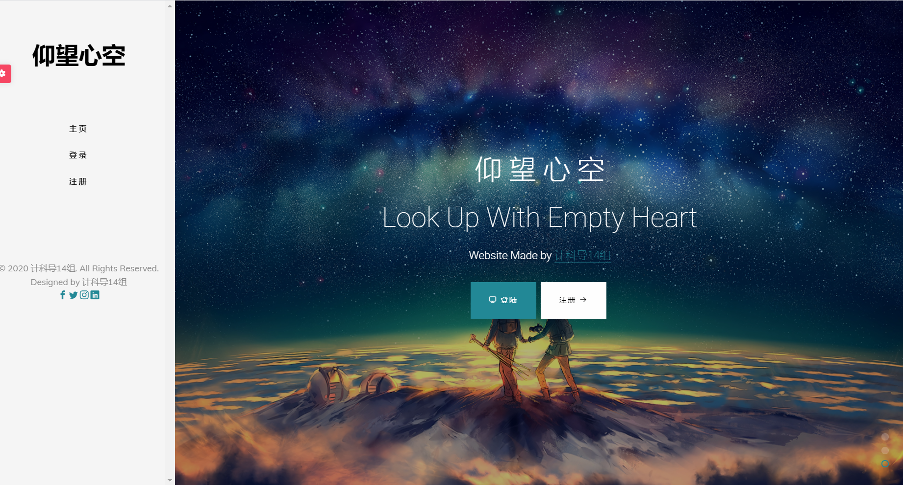

点击注册，注册时界面如下：
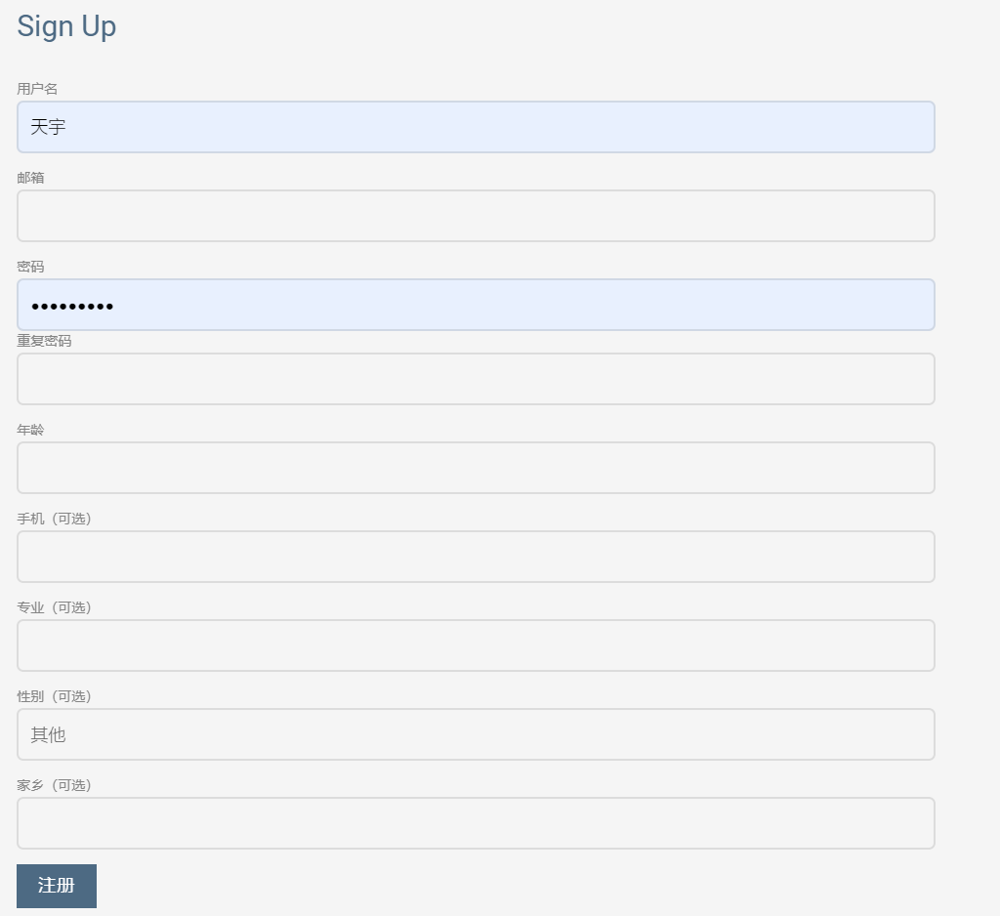

用户需要输入用户名、邮箱、密码、重复密码、年龄的信息，以及一些其他可选信息，注册完成后将跳转到登录页面：

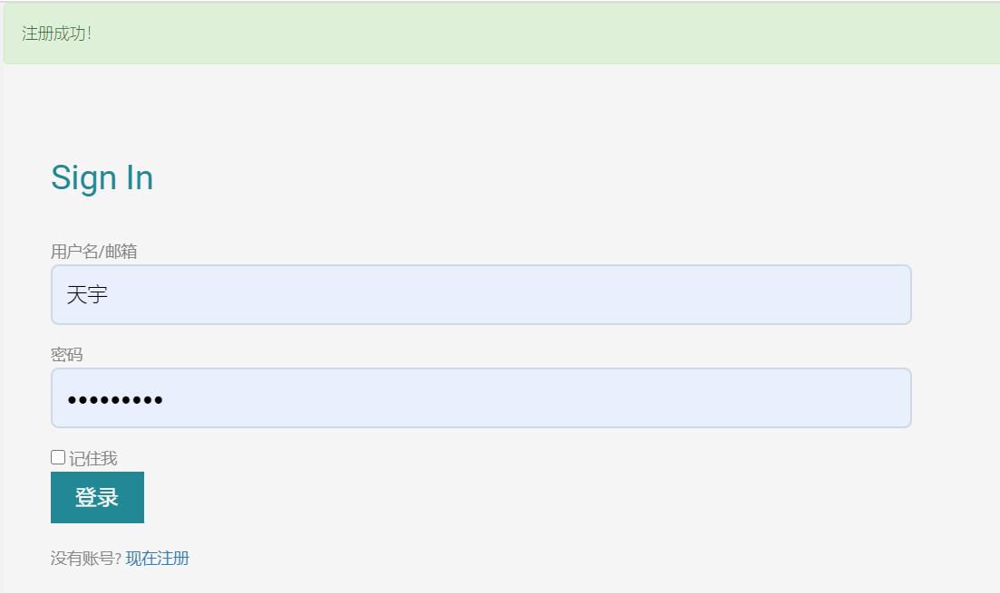

点击登录进入主页，完成注册与登录过程。

需要指出的是，用户登录前后在页面导航栏以及主页显示的内容有所不同，有些不登录不能进行的功能将在注册后不予显示，而注册前的“登录、注册”按钮则相应变为“个人中心、注销”。

##### 关键技术实现

使用flask_login库进行登录情况的判定

使用sqlite存储用户信息

使用wtform处理前端与后端的关系


<!-- ##### TODO

登录处应该有忘记密码的选项，不过限于时间没做（最后一点时间才想起来这个功能...）

登录处的“记住我”是假的，并不能真正记住密码，应该考虑日后完成。

注册界面的年龄应改为生日并设定下拉菜单，以计算出用户的年龄，专业与家乡也最好改为下拉菜单的形式，避免瞎写。

希望日后能完成注册邮箱/短信验证

##### 感想

是我完成的第一个部分，本来以为会比较麻烦，也不知道如何判断是否登录，不过在了解到flask_login后完美解决一切问题，看来python还是能用库解决的不需要思考啊。

虽然现在看逻辑上没有很困难的地方，不过最初在做的时候因为前后端都看不懂真的是寸步难行，好不容易才写出来一个很难看的登录界面。

在写完这个之后，对于分包与前端扩展base.html有了许多新的认识，之后可以说进度就快多了。经过后来多次修改，登录注册也不是最初丑丑的样子了！

不过限于能力与时间，还是留下了不少遗憾，日后重构吧。 -->

### 个人中心

#### 介绍

个人中心有两种进入模式，每种模式对应不同的功能：
- 用户进入自己的个人中心功能：
    - 修改个人信息/照片墙/头像
    - 看到自己发布的最近4条博客
    - 给自己点赞
    - 进入自己的博客中心
- 用户进入他人的个人中心功能：
    - 他人的个人资料展示
    - 他人最近4条博客的展示
    - 关注/取关
    - 点赞
    - 进入他人的博客中心

#### 界面展示

进入个人中心：
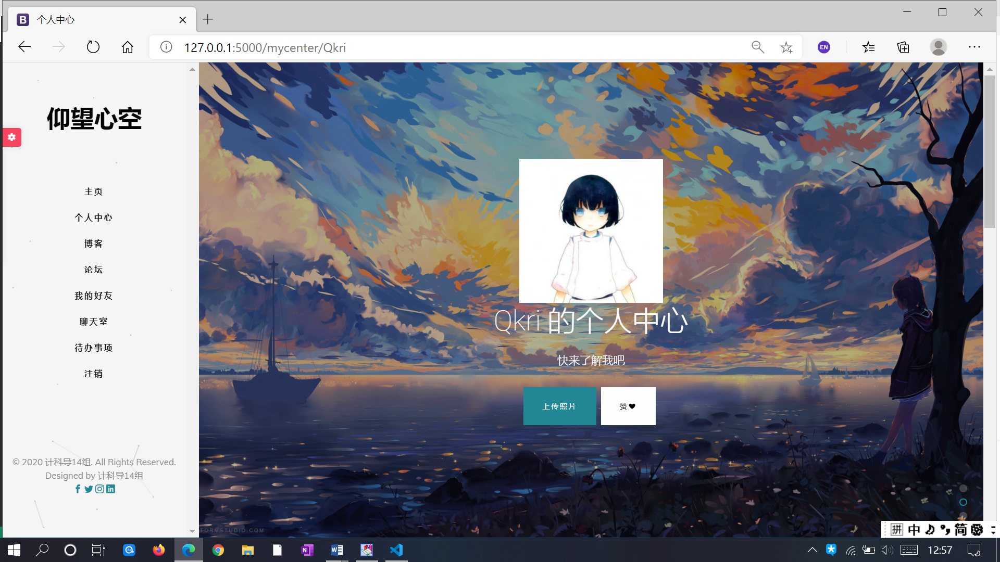

个人中心详细页面:
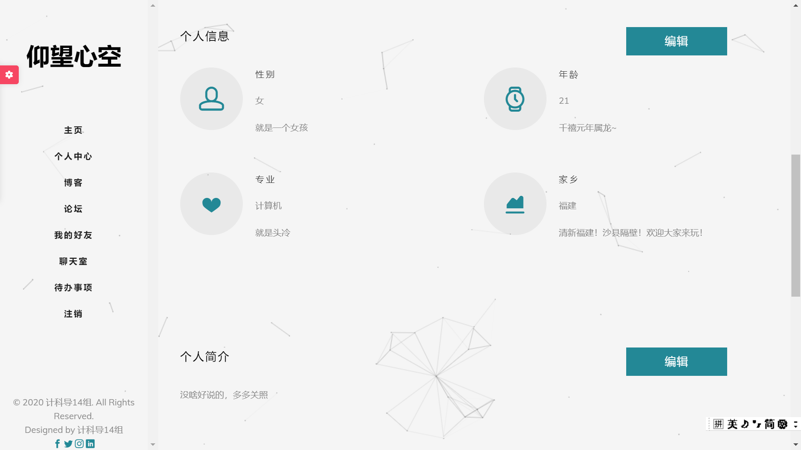

个人中心资料编辑：
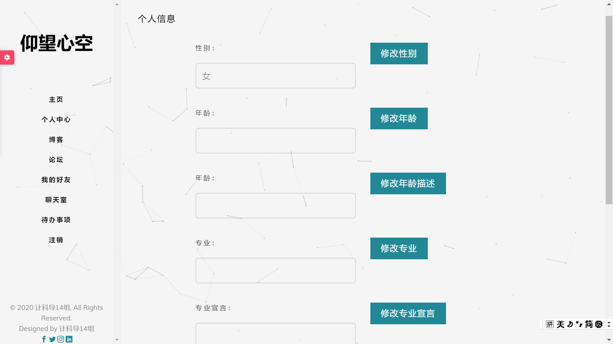

##### 关键技术实现

- 使用Jinja2模板系统，实现了不同访问者类型（自己/他人）进入个人中心时显示不同的界面与功能模块
- 使用flask-wtform插件，实现了浏览器与后端的数据交互，特别地，单个页面上多表单的独立更新被实现。
- 使用flask-sqlalchemy插件，实现了对sqlite数据库的ORM方式的操作，完成了个人中心数据的存储与修改。
- 使用flask-login插件，实现了对当前登陆用户信息的判定与获取。

### 博客

#### 介绍

- 概况
    - 博客有两个入口，一个是从主页进入，另一个从个人中心进入。<br>
    - 博客中心同样也根据不同的访问者类型，显示不同的模式，响应地展示不同的功能。<br>
- 功能说明:
    - 互动：浏览、点赞
    - 展示：博客列表，博客详细内容、博客配图
    - 编辑：写博客（同步至论坛、添加图片的博客）

#### 界面展示

进入博客中心：
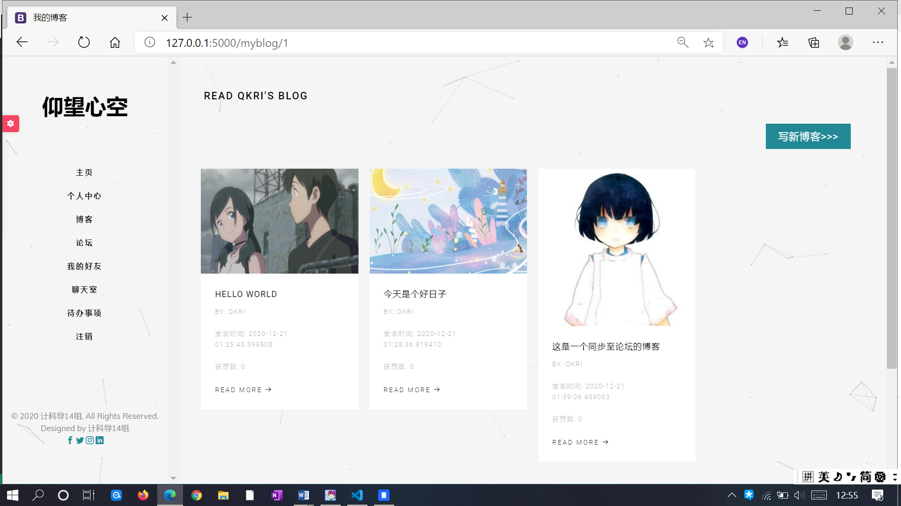

单个博客详细页面:
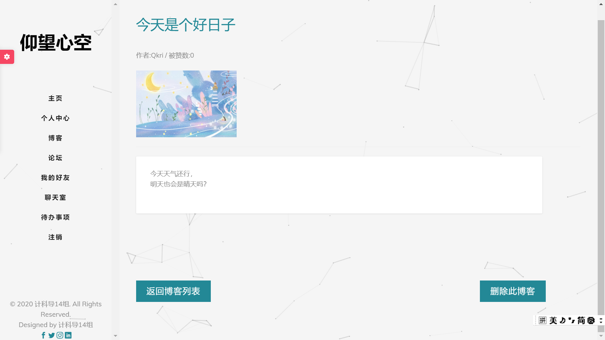

写博客界面：
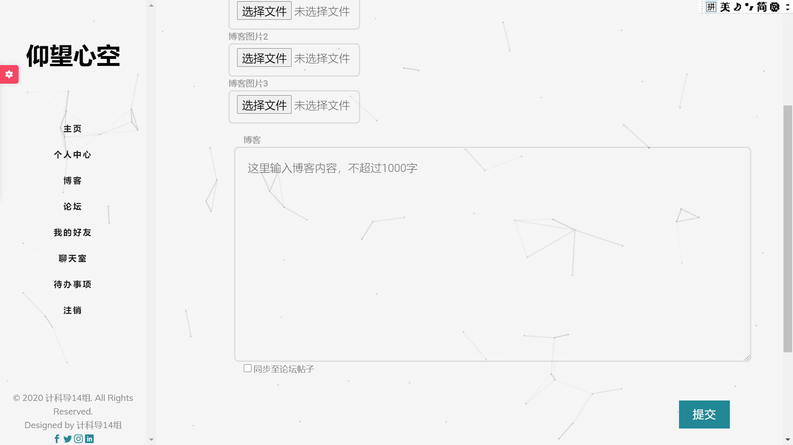

##### 关键技术实现

- 使用Jinja2模板系统，实现了不同访问者类型（自己/他人）进入博客中心时显示不同的界面与功能模块
- 使用flask-wtform插件，实现了浏览器与后端的数据交互。
	- 特别地，通过该插件提供的validator检查器，一定程度保证了输入数据的安全合理。
- 使用flask-sqlalchemy插件，实现了对sqlite数据库的ORM方式的操作，完成了博客数据的存储与删除。
	- 特别地，通过对数据库的操作，实现了将博客文字部分同步至论坛的功能点。
- 使用flask-login插件，实现了对当前登陆用户信息的判定与获取。
- 使用request请求处理文件


### 论坛

##### 介绍

论坛主要由以下四个部分组成：

所有帖子：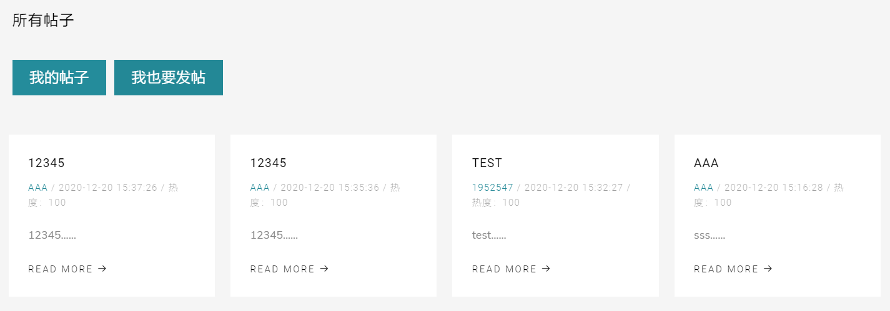
我的帖子：
帖子详情：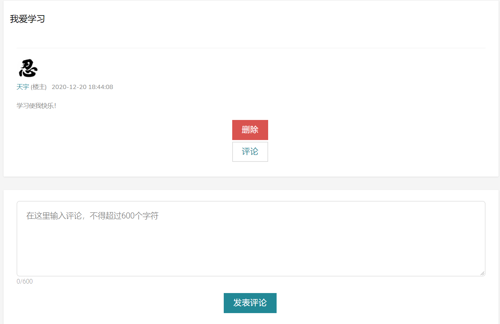
发帖页面：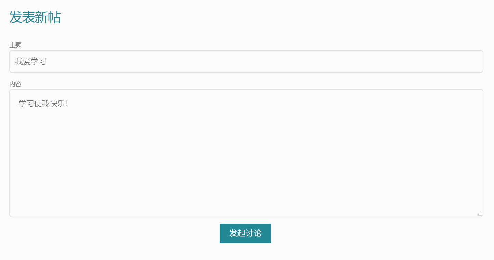

使用论坛功能需先登录，登陆后可点击相应按钮进行跳转，从而完成看帖、发帖等操作。

##### 关键技术实现

通过数据库的外键联系发帖与回复的关系，使二者联系起来。

<!-- ##### TODO

头像显示不够美观。

对于帖子的恢复目前只能有一次，不能实现楼中楼。

帖子中不能支持图片，也没有markdown格式。

论坛与博客的联系有待提升。

###### 感想

这部分代码逻辑比较简单，但是由于我们组找的模板中并没有相应的css格式，因此我引入了其他的css，并由此真正对前端代码有了一点了解。

由于各方面参考资料充足，这部分完成相对容易。 -->


### 好友列表 & 可能认识的人

##### 介绍

好友列表中从数据库加载了我关注的人和关注我的人，横向展示，包括好友头像和签名，从此处点击进入好友个人空间

此外，每次登录随即向用户推荐可能认识的人。

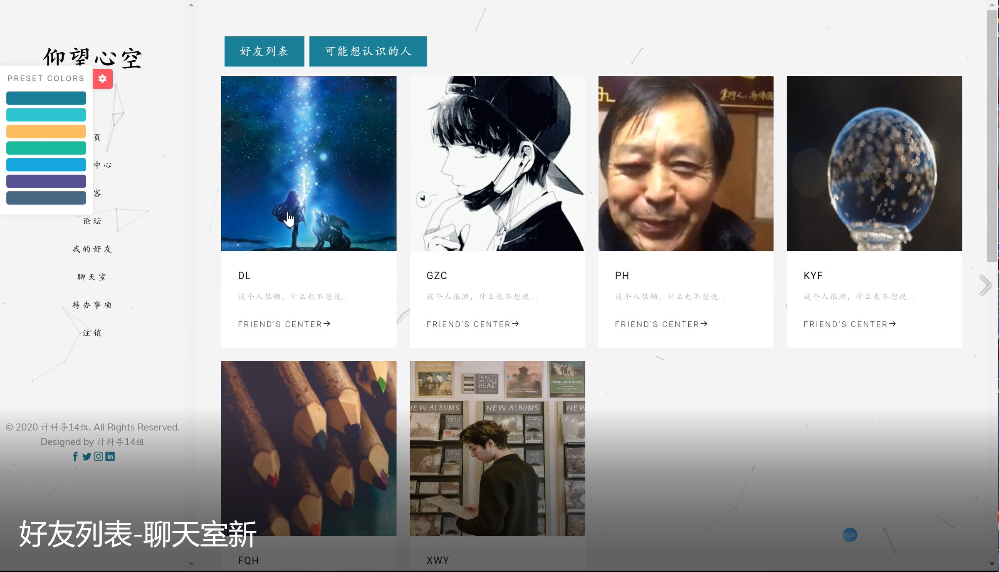

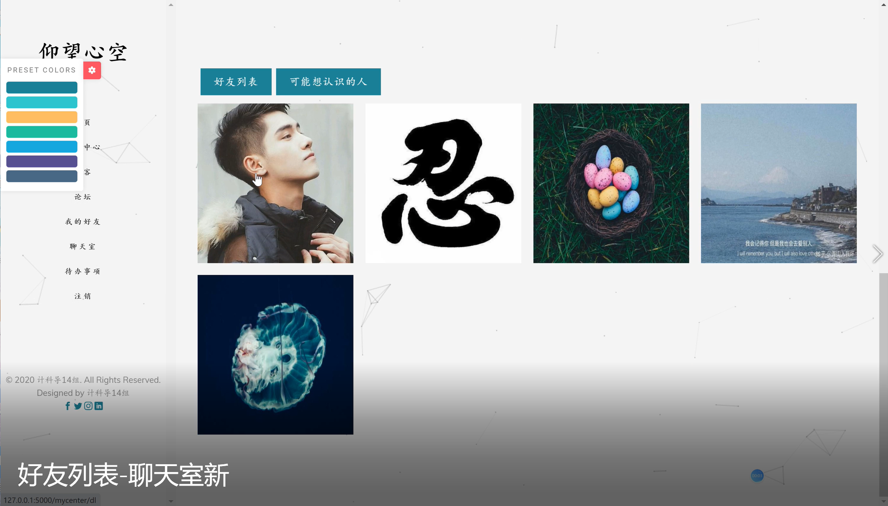

##### 关键技术实现

好友列表在数据库中查询单项关注的人,去重

可能认识的人在相互未关注者中反复筛选


##### TODO

好友列表的加载可以进一步优化。由于sqlite不能像MySQL一样设置多主键，查询时效果不理想，需要遍历全表查找我关注的人和关注我的人

现在采取的是横向方式4人一排的显示不够美观，可以考虑像聊天室那样做成列表形式

##### 感想

这部分内容逻辑较为简单，写起来较为顺手

虽然目前sqlite支持的条件下，focus表的设计满足3NF，但总感觉加载好友可以采用适当保留数据库冗余的方法提升性能

### 聊天室

##### 介绍

聊天室中可以和好友列表中的好友聊天

界面设计参考微信等主流聊天软件的电脑端，采用左侧好友列表，右侧聊天消息框的设计

左侧好友列表按相互之间最新一条消息的时间进行排序

右侧聊天框，显示消息记录数，按时间先后显示各条消息

实现逻辑上，采用的是数据库直接交互，以时间戳为序读取相互之间所有消息记录


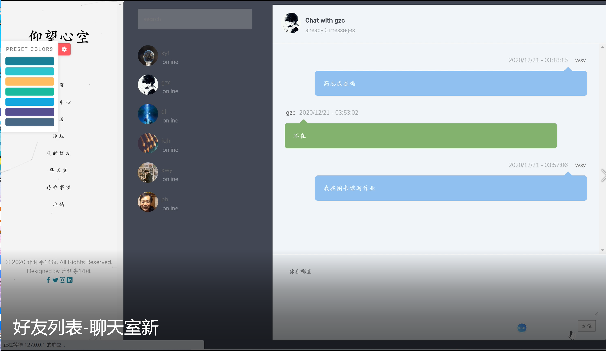

##### 关键技术实现

聊天记录使用数据库直接交互实现

聊天室好友列表按最新消息时间排序,由于消息主键自增,直接按消息主键排序

CSS 百分比设定窗口宽度,相对位置设定窗体相对位置,保持窗体不变形

发送消息后redirect跳转刷新页面


##### TODO

聊天室的交互无法做到真正的实时，可以改用socketio

没有添加群聊、发送表情、图片、文件等功能

没有做消息撤回、消息记录查找、删除等功能

##### 感想

这部分算是网站中细节较为繁琐的功能之一，原本准备做不完的话就放弃

但最后几天赶了ddl，还是把这个功能做出来了


### 待办事项

待办事项以一个列表实现事件与日期的存储

#### 页面显示

数据库中的记录将通过表格显示在网页上, 可以进行拖拽排序

#### ADD功能

可以添加一项事件, 最多支持32个

#### 界面展示

- 查看界面
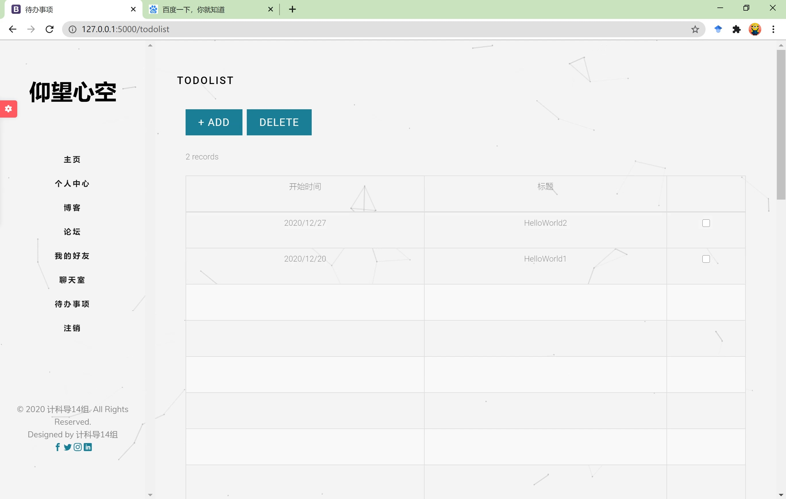

- 添加界面
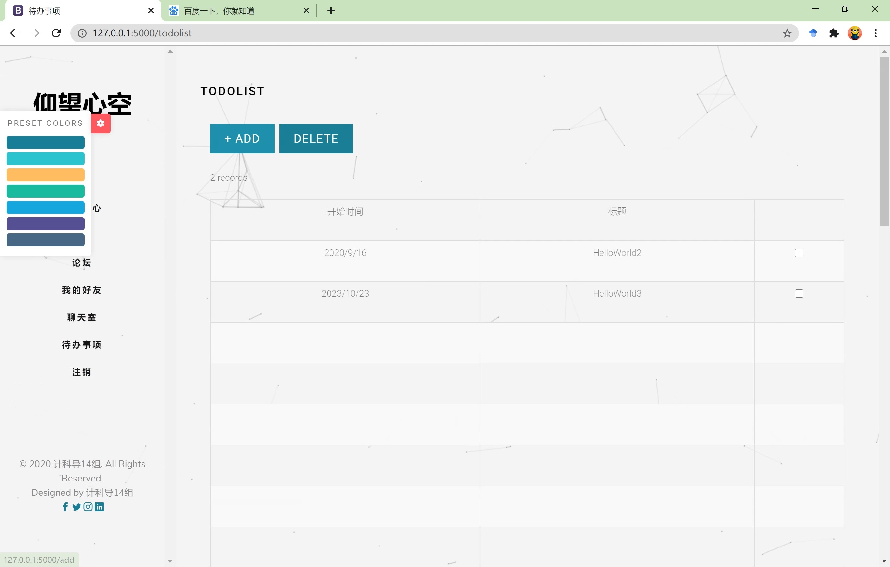

##### 关键技术实现

使用dragsort.js进行拖拽排序


---

## 开发说明

### 项目目录结构
```
│  app.py       //注册蓝图与项目运行
│  config.py    //联系数据库
│  data.db      //数据库
│  db_create.py //建立数据库
│  
├─app
│  │  __init__.py
│  │  
│  ├─account_manage //登录注册
│  │  │  forms.py
│  │  │  models.py
│  │  │  tools.py
│  │  │  views.py
│  │  │  __init__.py 
│  │          
│  ├─bbs            //论坛
│  │  │  forms.py
│  │  │  models.py
│  │  │  views.py
│  │  │  __init__.py
│  │          
│  ├─chatroom       //聊天室
│  │  │  forms.py
│  │  │  models.py
│  │  │  views.py
│  │  │  __init__.py
│  │          
│  ├─focus_manage   //好友列表
│  │  │  models.py
│  │  │  views.py
│  │  │  __init__.py
│  │          
│  ├─myblog         //博客
│  │  │  forms.py
│  │  │  models.py
│  │  │  views.py
│  │  │  __init__.py
│  │          
│  ├─mycenter       //个人中心
│  │  │  forms.py
│  │  │  models.py
│  │  │  picture.py
│  │  │  views.py
│  │  │  __init__.py
│  │          
│  ├─static         //静态文件
│  │  ├─css
│  │  │      
│  │  ├─fonts
│  │  │          
│  │  ├─images
│  │  │      
│  │  ├─js
│  │  │          
│  │  └─sass
│  │                  
│  ├─templates      //html模板
│  │      
│  ├─todolist       //待办事项
│  │  │  forms.py
│  │  │  models.py
│  │  │  views.py
│  │  │  __init__.py   
```    

### 小组成员&分工（字典序）

- 戴浏 —— 部分前端
- 范千惠 —— 个人中心&博客
- 高志成 —— 部分前端
- 姜星宇 —— 待办事项
- 孔艺菲 —— 所有图片的处理、维护和展示
- 田宇 —— 登陆注册&论坛
- 王上游 —— 好友列表&线上聊天室

我们所有同学都参与了一部分前端HTML、CSS、JS的开发。

期间组织了多次集体学习，大家一起理解前后端各方面知识。

后期，五位同学共同参与了后端编写，前后端接通；两位同学进一步打磨美化前端。

### 其他说明

项目表单采用wtform，数据库采用sqlite，后端基本全由python完成。

GitHub链接： https://github.com/King-ty/LookUpWithEmptyHeart 

我们爱计科导！

<!-- 2. 目前项目中数据库构造函数仍有欠缺，每次更新任一models都会导致数据库出问题，需要删库重建，原因是没有考虑数据库版本更新问题，日后重构。

3. 本次开发小组内未使用git管理版本，而是基于QQ群的版本管理模式，造成一定混乱，今后一定要学会git！

4. 未部署到网络服务器，也没有邮箱验证，日后重构。 -->

<!-- ### 特别鸣谢

特别鸣谢刘孔阳、范正源、李博宇等人对本项目提供的技术帮助！ -->